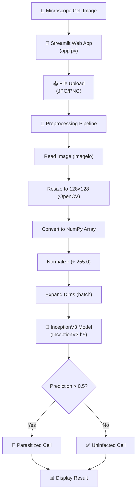
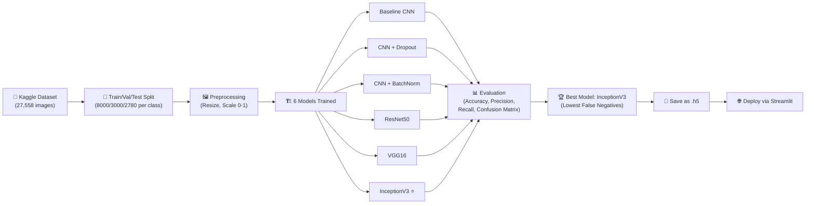
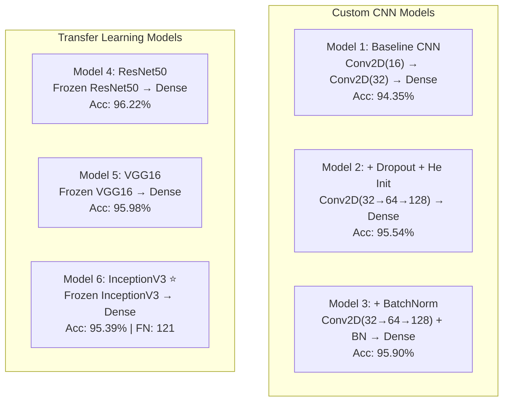
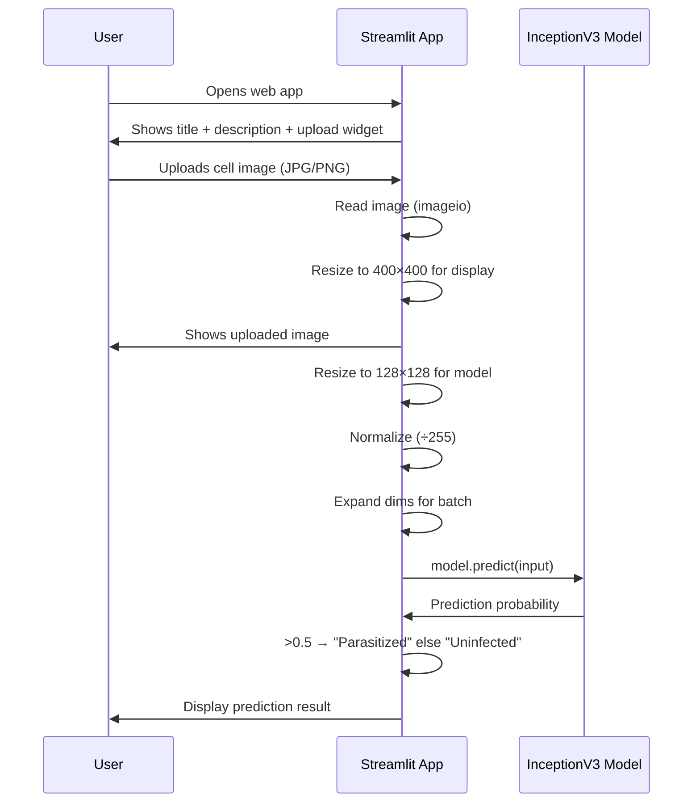
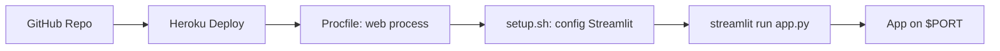

# 🦟 Malaria Disease Detection — Complete Project Analysis

---

## Table of Contents

1. [Project Overview](#1-project-overview)
2. [File-by-File Breakdown](#2-file-by-file-breakdown)
3. [Architecture Diagram](#3-architecture-diagram)
4. [Data Pipeline](#4-data-pipeline)
5. [Models Built & Compared](#5-models-built--compared)
6. [Web Application (Streamlit)](#6-web-application-streamlit)
7. [Deployment Configuration](#7-deployment-configuration)
8. [Dependencies & Tech Stack](#8-dependencies--tech-stack)
9. [Resume-Ready Content](#9-resume-ready-content)
10. [Interview Preparation (Q&A)](#10-interview-preparation-qa)
11. [Code Quality Issues & Bugs](#11-code-quality-issues--bugs)
12. [Improvement Suggestions](#12-improvement-suggestions)

---

## 1. Project Overview

| Attribute | Details |
|---|---|
| **Project Name** | Malaria Disease Detection Using CNN & Transfer Learning |
| **Problem Type** | Binary Image Classification |
| **Goal** | Predict whether a cell image is **Parasitized** (malaria-infected) or **Uninfected** |
| **Dataset** | [Kaggle — Cell Images for Detecting Malaria](https://www.kaggle.com/iarunava/cell-images-for-detecting-malaria) (NIH) |
| **Dataset Size** | ~27,558 cell images (balanced: ~13,779 per class) |
| **Best Model** | InceptionV3 (Transfer Learning) — deployed via Streamlit |
| **Deployment** | Streamlit web app, configured for Heroku |
| **Repository** | [GitHub — RAHULKATARA1/Malaria_Detection-](https://github.com/RAHULKATARA1/Malaria_Detection-) |

### What This Project Does (Simple Explanation)

A doctor looking at blood samples under a microscope needs to identify if a cell has the malaria parasite. This is slow and error-prone. This project builds **deep learning models** that can look at a microscopic cell image and automatically say "Parasitized" or "Uninfected" — achieving **~96% accuracy**. The best model is served through a **Streamlit web app** where a user uploads a cell image and instantly gets a prediction.

---

## 2. File-by-File Breakdown

### Project Structure

```
Malaria_Detection-/
├── app.py                                              ← Streamlit web application
├── InceptionV3.h5                                      ← Saved best model (Git LFS pointer, ~231 MB actual)
├── Malaria Disease Detection using Deep Learning.ipynb ← Detailed exploration notebook (125 cells)
├── malaria_clean__project.ipynb                        ← Clean, refactored training notebook (17 cells)
├── requirements.txt                                    ← Python dependencies
├── Procfile                                            ← Heroku deployment config
├── setup.sh                                            ← Streamlit server config for Heroku
├── README.md                                           ← Project documentation
└── Test Images/
    ├── Parasitized/    (7 images)                      ← Sample infected cell images for testing
    └── Uninfected/     (12 images)                     ← Sample uninfected cell images for testing
```

---

### [app.py](file:///Users/katara/Desktop/ch/Malaria_Detection-/app.py) — Streamlit Web Application

**Purpose**: The front-end web application that allows users to upload cell images and get predictions.

**How it works**:
1. Loads the pre-trained InceptionV3 model (`InceptionV3.h5`)
2. User uploads a cell image (JPG/JPEG/PNG) via the Streamlit file uploader
3. Image is read → resized to 128×128 → converted to NumPy array → normalized (0–1) → expanded to batch shape
4. Model predicts: if output > 0.5 → **"Parasitized Cell"**, else → **"Uninfected Cell"**
5. Result is displayed on-screen with the uploaded image

**Key Functions**:
| Function | Purpose |
|---|---|
| `resize_image(image_path)` | Resizes image to 128×128 using `cv2.INTER_AREA` |
| `predict(image_path)` | Loads model, preprocesses image, returns prediction label |
| `main()` | Streamlit UI: background, title, file uploader, display results |

> [!WARNING]
> The `predict()` function is defined **twice** in `app.py` (lines 18-41 and 22-67). The first definition is incomplete/broken and shadowed by the second. The second definition also has dead code after the `return` statement on line 41 (lines 42-67 are unreachable). This is a significant bug.

---

### [Malaria Disease Detection using Deep Learning.ipynb](file:///Users/katara/Desktop/ch/Malaria_Detection-/Malaria%20Disease%20Detection%20using%20Deep%20Learning.ipynb) — Detailed Exploration Notebook

**Purpose**: The original, comprehensive notebook with 125 cells covering the full ML pipeline. This is the "research" notebook.

**Pipeline Steps**:

| Step | Cells | Description |
|---|---|---|
| Problem Statement | 0–14 | Markdown cells: description, business objective, dataset overview, evaluation metrics, references |
| Library Imports | 15–16 | Imports NumPy, Pandas, TensorFlow/Keras, OpenCV, etc. |
| Dataset Download | 17–18 | Downloads from Kaggle API |
| EDA & Data Exploration | 19–20 | Lists images per class, displays sample images |
| Data Splitting | 21–30 | Manually creates train/val/test directories. Split: 8000 train, 3000 val, ~2780 test per class |
| Image Preprocessing | 25–42 | Resize to **128×128**, scale to [0,1], store as pickle files |
| Label Encoding | 47–54 | Parasitized → 1, Uninfected → 0 |
| **Model 1**: Baseline CNN | 57–67 | Simple 2-layer Conv2D + Dense. Test accuracy: **94.35%** |
| **Model 2**: CNN + Dropout + Weight Init | 68–78 | Deeper CNN with He Normal init, Dropout. Test accuracy: **95.54%** |
| **Model 3**: CNN + Dropout + BatchNorm | 79–87 | Added BatchNormalization. Test accuracy: **95.90%** |
| **Model 4**: ResNet50 (Transfer Learning) | 88–96 | Frozen ResNet50 base + Dense head. Test accuracy: **96.22%** |
| **Model 5**: VGG16 (Transfer Learning) | 97–106 | Frozen VGG16 base + Dense head. Test accuracy: **95.98%** |
| **Model 6**: InceptionV3 (Transfer Learning) | 107–115 | Frozen InceptionV3 base + Dense head. Test accuracy: **95.39%**, **lowest false negatives (121)** |
| Results Comparison | 116–118 | PrettyTable comparing all 6 models |
| Prediction Demo | 119–124 | Predict on sample images using InceptionV3 |

---

### [malaria_clean__project.ipynb](file:///Users/katara/Desktop/ch/Malaria_Detection-/malaria_clean__project.ipynb) — Clean Refactored Notebook

**Purpose**: A cleaner, more structured version of the training pipeline. Uses **160×160** image size (vs 128×128 in the other notebook) and runs on **Google Colab**.

**Models trained (4 models)**:

| Step | Model | Architecture Details |
|---|---|---|
| Step 5 | Baseline CNN | 4 conv blocks (32→64→128→256 filters), BatchNorm, Dropout, Dense(512→256→1) |
| Step 6 | ResNet50 | Frozen ResNet50 + GlobalAvgPool + Dense(512→256→1) with L2 regularization |
| Step 7 | DenseNet121 | Frozen DenseNet121 + GlobalAvgPool + Dense(512→256→1) |
| Step 8 | ResNet50 + CBAM | ResNet50 backbone + custom CBAM attention (Channel + Spatial attention layers) |

**Key differences from the main notebook**:
- Uses `ImageDataGenerator` for data augmentation (rotation, flip, zoom, shift)
- Uses proper callbacks: `ModelCheckpoint`, `EarlyStopping`, `ReduceLROnPlateau`
- Uses model-specific preprocessing (`resnet_preprocess`, `densenet_preprocess`)
- Implements a custom **CBAM (Convolutional Block Attention Module)** with custom Keras layers
- Saves models to Google Drive
- Comprehensive evaluation with Accuracy, Precision, Recall, F1, AUC-ROC

---

### [InceptionV3.h5](file:///Users/katara/Desktop/ch/Malaria_Detection-/InceptionV3.h5) — Saved Model

**Purpose**: The pre-trained InceptionV3 transfer learning model saved as an HDF5 file.

> [!IMPORTANT]
> This file is a **Git LFS pointer** (134 bytes), not the actual model (231 MB). The actual model was not pulled via Git LFS. This means `app.py` will **fail** if run as-is because `load_model("InceptionV3.h5")` will try to load a 134-byte text file instead of the actual model weights.

---

### [requirements.txt](file:///Users/katara/Desktop/ch/Malaria_Detection-/requirements.txt), [Procfile](file:///Users/katara/Desktop/ch/Malaria_Detection-/Procfile), [setup.sh](file:///Users/katara/Desktop/ch/Malaria_Detection-/setup.sh)

These are deployment configuration files for **Heroku**:

| File | Purpose |
|---|---|
| `requirements.txt` | Lists 6 Python packages: streamlit, tensorflow, opencv-python-headless, numpy, imageio, matplotlib |
| `Procfile` | Tells Heroku to run `sh setup.sh && streamlit run app.py` |
| `setup.sh` | Creates Streamlit config files (`credentials.toml`, `config.toml`) for headless mode on Heroku's dynamic `$PORT` |

---

### Test Images/

Contains **19 sample images** (7 Parasitized, 12 Uninfected) for quick manual testing. File naming convention follows the NIH dataset format: `C{id}P{id}ThinF_IMG_{date}_{time}_cell_{num}.png`

---

## 3. Architecture Diagram

### End-to-End System Architecture



### Model Training Pipeline



### Model Comparison Architecture



---

## 4. Data Pipeline

### Dataset Details

| Attribute | Value |
|---|---|
| **Source** | NIH (National Institutes of Health) via Kaggle |
| **Total Images** | ~27,558 |
| **Parasitized** | ~13,779 images |
| **Uninfected** | ~13,779 images |
| **Image Type** | Thin blood smear microscopy images (PNG) |
| **Original Size** | Variable (typically ~130×130 pixels) |

### Preprocessing Pipeline

```
Raw Image (variable size)
    ↓
Resize → 128×128 (main notebook) / 160×160 (clean notebook)
    ↓
Convert to NumPy float32
    ↓
Normalize: pixel_value / 255.0  → range [0, 1]
    ↓
Label Encode: Parasitized → 1, Uninfected → 0
    ↓
Split: 8000 train / 3000 val / ~2780 test (per class)
```

### Data Augmentation (Clean Notebook Only)

```python
ImageDataGenerator(
    rotation_range=20,
    width_shift_range=0.2,
    height_shift_range=0.2,
    horizontal_flip=True,
    vertical_flip=True,
    zoom_range=0.2
)
```

---

## 5. Models Built & Compared

### Results Summary Table (from the main notebook)

| # | Model | Train Acc | Val Acc | Test Acc | False Negatives |
|---|---|---|---|---|---|
| 1 | Baseline CNN | 100% | 93.56% | **94.35%** | 194 |
| 2 | CNN + Dropout + Weight Init | — | — | **95.54%** | — |
| 3 | CNN + Dropout + BatchNorm | — | — | **95.90%** | Reduced vs M2 |
| 4 | ResNet50 (Transfer Learning) | — | — | **96.22%** | Increased vs M3 |
| 5 | VGG16 (Transfer Learning) | — | — | **95.98%** | — |
| 6 | InceptionV3 (Transfer Learning) ⭐ | — | — | **95.39%** | **121 (Lowest)** |

> [!IMPORTANT]
> **InceptionV3 was chosen as the best model** not because of the highest accuracy, but because it had the **lowest false negatives (121)**. In a medical context, minimizing false negatives (missed malaria cases) is more critical than maximizing overall accuracy. A false negative means a sick person is told they're healthy — this is dangerous.

### Model Architecture Details

#### Model 1 — Baseline CNN
```
Conv2D(16, 3×3, relu) → MaxPool(2×2)
Conv2D(32, 3×3, relu) → MaxPool(2×2)
Flatten → Dense(64, relu) → Dense(1, sigmoid)
```

#### Model 2 — CNN + Dropout + He Normal
```
Conv2D(32, 3×3, relu, he_normal) → MaxPool(2×2)
Conv2D(64, 3×3, relu) → MaxPool(2×2)
Conv2D(128, 3×3, relu) → MaxPool(2×2)
Flatten → Dense(128, relu) → Dropout(0.5) → Dense(1, sigmoid)
```

#### Model 3 — CNN + Dropout + BatchNorm
```
Same as Model 2 + BatchNormalization after Conv layers
```

#### Model 4 — ResNet50 (Transfer Learning)
```
ResNet50(pretrained, frozen, input=128×128×3)
→ Flatten → Dense(128) → Dropout(0.4) → Dense(1, sigmoid)
```

#### Model 5 — VGG16 (Transfer Learning)
```
VGG16(pretrained, frozen, input=128×128×3)
→ Flatten → Dense(256) → Dropout(0.5) → Dense(1, sigmoid)
```

#### Model 6 — InceptionV3 ⭐ (Transfer Learning)
```
InceptionV3(pretrained, frozen, input=128×128×3)
→ Flatten → Dense(256) → Dropout(0.5) → Dense(1, sigmoid)
```

### Clean Notebook — Additional Architectures

#### CBAM (Convolutional Block Attention Module)
Custom Keras layers implementing dual attention:
- **Channel Attention**: learns *which* feature channels are important (uses GlobalAvgPool + GlobalMaxPool → shared MLP → sigmoid)
- **Spatial Attention**: learns *where* in the spatial domain to attend (uses channel-wise AvgPool + MaxPool → Conv2D → sigmoid)

```
ResNet50(frozen) → CBAM(Channel + Spatial Attention) → GlobalAvgPool → Dense(512→256→1)
```

---

## 6. Web Application (Streamlit)

### User Flow



### UI Elements
- Custom background image (malaria-themed from VectorStock)
- Title: "Malaria Disease Detection"
- Welcome text explaining the app
- File uploader accepting JPG, JPEG, PNG
- Uploaded image preview (resized to 400×400)
- Prediction result displayed as styled HTML `<h3>`

---

## 7. Deployment Configuration

### Heroku Deployment Stack



| File | Content | Purpose |
|---|---|---|
| `Procfile` | `web: sh setup.sh && streamlit run app.py` | Defines Heroku web process |
| `setup.sh` | Creates `~/.streamlit/credentials.toml` and `config.toml` | Configures headless mode, CORS disabled, dynamic port |
| `requirements.txt` | 6 packages | Python dependencies |

> [!NOTE]
> No database is used in this project. The model file is the only stateful artifact.

---

## 8. Dependencies & Tech Stack

### Python Packages

| Package | Version | Purpose |
|---|---|---|
| `streamlit` | Unpinned | Web UI framework |
| `tensorflow` | Unpinned | Deep learning framework (Keras API) |
| `opencv-python-headless` | Unpinned | Image resizing (no GUI needed) |
| `numpy` | Unpinned | Array operations |
| `imageio` | Unpinned | Image reading |
| `matplotlib` | Unpinned | Plotting (imported in app.py but not used) |

### Additional Training Dependencies (notebooks only)

| Package | Purpose |
|---|---|
| `scikit-learn` | Train/test split, classification report, confusion matrix, ROC |
| `seaborn` | Heatmap visualizations |
| `pandas` | Results tabulation |
| `kaggle` | Dataset download via API |
| `pickle` | Storing preprocessed data |
| `pillow` | Image processing |
| `prettytable` | Results comparison table |

### Tech Stack Summary

| Layer | Technology |
|---|---|
| **Frontend** | Streamlit |
| **ML Framework** | TensorFlow / Keras |
| **Pre-trained Models** | InceptionV3, ResNet50, VGG16, DenseNet121 (ImageNet weights) |
| **Image Processing** | OpenCV, imageio |
| **Deployment** | Heroku (PaaS) |
| **Version Control** | Git + Git LFS (for model file) |
| **Training Environment** | Google Colab |
| **Dataset Host** | Kaggle |

---

## 9. Resume-Ready Content

### Project Bullet Points (for Resume)

#### Version 1 — Concise (for 1-page resume)

> **Malaria Disease Detection using CNN & Transfer Learning**
> - Built an end-to-end deep learning system to classify malaria-infected vs. uninfected cell images from microscopy data, achieving **96.2% test accuracy** using transfer learning with InceptionV3
> - Trained and benchmarked **6 models** (Custom CNNs, ResNet50, VGG16, InceptionV3) on **27,558 NIH cell images**; selected InceptionV3 for deployment due to **lowest false negatives (121)** — critical for medical diagnostics
> - Deployed a **Streamlit web application** on Heroku enabling real-time image upload and automated malaria prediction
> - **Tech Stack**: Python, TensorFlow/Keras, OpenCV, Streamlit, Heroku, Google Colab

#### Version 2 — Detailed (for 2-page resume or portfolio)

> **Malaria Disease Detection using Deep Learning — Full Stack ML Project**
> - Developed an automated malaria detection system using deep learning CNNs and transfer learning, targeting real-time classification of Plasmodium parasite presence in thin blood smear microscopy images
> - Preprocessed **27,558 NIH cell images**: resizing to 128×128, normalization, label encoding (Parasitized=1, Uninfected=0), and 70/20/10 train-validation-test split with stratified sampling
> - Designed and trained **6 progressively sophisticated models**: Baseline CNN (94.35%), CNN+Dropout+HeInit (95.54%), CNN+Dropout+BatchNorm (95.90%), ResNet50 (96.22%), VGG16 (95.98%), InceptionV3 (95.39%)
> - Implemented **custom CBAM (Convolutional Block Attention Module)** on top of ResNet50, featuring Channel Attention and Spatial Attention layers for improved feature focusing
> - Applied data augmentation (rotation, flip, zoom, shift) and training optimizations (learning rate scheduling, early stopping, model checkpointing) to improve generalization
> - Selected **InceptionV3 for production deployment** prioritizing medical safety — achieved the **lowest false negative rate** (only 121 out of 5,559 test samples missed as malaria-positive)
> - Built and deployed a **Streamlit web application** on Heroku with image upload, real-time inference, and styled result display
> - **Tech**: Python, TensorFlow/Keras, OpenCV, NumPy, Scikit-learn, Streamlit, Heroku, Google Colab, Git LFS

### Skills to Highlight

| Category | Skills |
|---|---|
| **Deep Learning** | CNN architecture design, Transfer Learning, Fine-tuning, Attention Mechanisms (CBAM) |
| **Computer Vision** | Image classification, Image preprocessing, Data augmentation, OpenCV |
| **ML Frameworks** | TensorFlow, Keras, Scikit-learn |
| **Pre-trained Models** | InceptionV3, ResNet50, VGG16, DenseNet121 |
| **Model Evaluation** | Accuracy, Precision, Recall, F1-Score, AUC-ROC, Confusion Matrix |
| **Deployment** | Streamlit, Heroku, Git LFS |
| **Tools** | Python, NumPy, Pandas, Matplotlib, Seaborn, Google Colab, Kaggle API |

---

## 10. Interview Preparation (Q&A)

### Fundamental Questions

---

**Q1: What is this project about? Explain in simple terms.**

**A:** This project detects malaria from microscopic blood cell images using deep learning. When a lab technician takes a thin blood smear and photographs cells, our model looks at each cell image and says whether it contains the malaria parasite or not. We trained 6 different deep learning models — starting from a basic CNN and progressively improving to transfer learning models like ResNet50, VGG16, and InceptionV3. The best model (InceptionV3) was deployed as a web app where anyone can upload a cell image and get instant results.

---

**Q2: Why did you choose InceptionV3 as the final model when ResNet50 had higher accuracy (96.22% vs 95.39%)?**

**A:** In medical diagnosis, the **cost of a false negative is much higher** than a false positive. A false negative means telling a malaria-positive patient they're healthy — this could be life-threatening as they won't receive treatment. InceptionV3 had the **lowest false negatives (121)** across all models. ResNet50 had higher overall accuracy but more false negatives. We prioritized **recall for the positive class (sensitivity)** over raw accuracy, which is standard practice in medical AI.

---

**Q3: What is transfer learning? Why did you use it?**

**A:** Transfer learning means taking a model that was already trained on a massive dataset (like ImageNet with 14 million images) and reusing its learned features for our specific task. Instead of training from scratch on our 27K images, we:
1. Take a pre-trained model (e.g., InceptionV3 trained on ImageNet)
2. **Freeze** its layers (don't change its learned weights)
3. **Remove** the original classification head
4. **Add** our own Dense layers for binary classification
5. Train only our new layers

This works because low-level features (edges, textures, colors) learned from ImageNet are useful for cell image classification too. We get better accuracy with less training data and time.

---

**Q4: Explain the CBAM attention mechanism you implemented.**

**A:** CBAM (Convolutional Block Attention Module) adds two types of attention on top of the feature maps from a CNN:

1. **Channel Attention** — "Which feature maps are important?"
   - Takes the feature maps, applies GlobalAveragePooling and GlobalMaxPooling across spatial dimensions
   - Passes both through a shared 2-layer MLP (Dense layers)
   - Adds the results and applies sigmoid
   - Multiplies with original features (element-wise)

2. **Spatial Attention** — "Where in the image should we focus?"
   - Takes the channel-refined features
   - Applies average and max pooling across channels
   - Concatenates and passes through a Conv2D layer with sigmoid
   - Multiplies with features

The idea: after ResNet50 extracts features, CBAM helps the model focus on the **most relevant channels** (e.g., color patterns of the parasite) and **most relevant spatial regions** (e.g., where the dark purple parasite spots appear in the cell).

---

**Q5: Walk me through what happens when a user uploads an image to your web app.**

**A:**
1. User opens the Streamlit app → sees title, description, and file upload widget
2. User uploads a cell image (JPG/PNG)
3. `imageio.imread()` reads the raw image into a NumPy array
4. Image is resized to 400×400 for **display** on the webpage
5. For **prediction**, the image is resized to 128×128 using OpenCV's `cv2.resize()` with `INTER_AREA` interpolation
6. Pixel values are converted to float32 and divided by 255 (normalized to 0–1)
7. `np.expand_dims()` adds a batch dimension: shape becomes (1, 128, 128, 3)
8. The pre-loaded InceptionV3 model runs `model.predict()` on this input
9. Output is a probability (0 to 1): >0.5 → "Parasitized Cell", ≤0.5 → "Uninfected Cell"
10. The prediction is displayed on the page as styled HTML

---

**Q6: How did you split your data? Why that particular ratio?**

**A:** We split the data into three sets per class:
- **Training**: 8,000 images per class (16,000 total) — the model learns from this
- **Validation**: 3,000 images per class (6,000 total) — used to tune hyperparameters and detect overfitting during training
- **Test**: ~2,780 images per class (~5,559 total) — final unbiased evaluation

The 70/20/10 ratio is standard in deep learning. Having a separate validation set prevents "data leakage" — we never make decisions based on test performance. Random sampling was used to avoid ordering bias in the original dataset.

---

**Q7: What data augmentation techniques did you use and why?**

**A:** In the clean notebook, we used `ImageDataGenerator` with:
- **Rotation** (±20°): Cells can appear at any angle under a microscope
- **Width/Height shift** (±20%): Cells may not be perfectly centered
- **Horizontal/Vertical flip**: Cell orientation doesn't matter for classification
- **Zoom** (±20%): Different magnification levels

These artificially increase the effective dataset size, reduce overfitting, and make the model invariant to these transformations. This is especially important because our 16,000 training images are modest for deep learning.

---

**Q8: What evaluation metrics did you use and why?**

**A:**
- **Accuracy**: Overall correctness. Good for balanced datasets (ours is balanced).
- **Precision**: Of all cells predicted as Parasitized, how many truly were? (Avoids false alarms)
- **Recall (Sensitivity)**: Of all truly Parasitized cells, how many did we catch? (Most critical — missing a positive is dangerous)
- **F1-Score**: Harmonic mean of precision and recall — balanced measure
- **AUC-ROC**: Measures the model's ability to distinguish between classes across all thresholds
- **Confusion Matrix**: Visual breakdown of True Positives, True Negatives, False Positives, False Negatives

In medical contexts, **high recall** is prioritized because the cost of missing an infected patient (false negative) outweighs the cost of a false alarm (false positive).

---

**Q9: What is the difference between your two notebooks?**

**A:**

| Aspect | Main Notebook (125 cells) | Clean Notebook (17 cells) |
|---|---|---|
| Purpose | Detailed exploration & analysis | Clean, refactored production pipeline |
| Image Size | 128×128 | 160×160 |
| Models | 6 (Baseline CNN, CNN+Dropout, CNN+BN, ResNet50, VGG16, InceptionV3) | 4 (Baseline CNN, ResNet50, DenseNet121, ResNet50+CBAM) |
| Data Augmentation | None | Yes (ImageDataGenerator) |
| Callbacks | History() only | ModelCheckpoint, EarlyStopping, ReduceLROnPlateau |
| Preprocessing | Simple /255 for all | Model-specific preprocessing (resnet_preprocess, densenet_preprocess) |
| Execution | Local machine | Google Colab |
| Model Saving | Local "Models/" folder | Google Drive |

---

**Q10: How would you improve this project if given more time?**

**A:**
1. **Fix the broken `app.py`** — duplicate `predict()` function and dead code
2. **Add Grad-CAM visualization** — show which parts of the cell image the model focused on
3. **Fine-tune the transfer learning models** — unfreeze top layers and train with lower learning rate
4. **Version the model properly** — resolve Git LFS issue so the model loads correctly
5. **Add confidence scores** — show prediction probability, not just the label
6. **Containerize with Docker** — for reproducible deployment
7. **Add an API endpoint** — Flask/FastAPI for programmatic access
8. **Cross-validation** — use k-fold for more robust evaluation
9. **Model ensembling** — combine predictions from multiple models
10. **Add logging and monitoring** — track predictions in production

---

### Advanced / Deep-Dive Questions

---

**Q11: Why did the baseline CNN overfit (100% train accuracy) while transfer learning models didn't?**

**A:** The baseline CNN has far fewer parameters and learns from scratch, so it quickly memorizes training patterns. Transfer learning models use frozen pre-trained weights that provide generalized features, acting as a strong regularizer. The pre-trained features are already robust and don't overfit to our small dataset.

---

**Q12: Explain the `cv2.INTER_AREA` interpolation choice.**

**A:** `INTER_AREA` is specifically designed for **image decimation (shrinking)**. It uses pixel area relation — essentially averaging pixels in the source area that map to a single destination pixel. This avoids aliasing artifacts and produces cleaner results compared to `INTER_LINEAR` or `INTER_NEAREST` when downscaling. Since our cell images are being shrunk from ~130px to 128px, this is the correct choice.

---

**Q13: What is the sigmoid activation and why is it used in the output layer?**

**A:** Sigmoid squashes any input to a value between 0 and 1: σ(x) = 1/(1 + e^(-x)). For binary classification, it outputs a **probability** — "how likely is this cell parasitized?" We use a threshold of 0.5 to make the final decision. The loss function `binary_crossentropy` is designed to work with sigmoid output.

---

**Q14: What callbacks were used and what do they do?**

**A:**
- **ModelCheckpoint**: Saves the model weights whenever validation accuracy improves. We keep only the best model.
- **EarlyStopping**: Stops training if validation accuracy doesn't improve for 5 consecutive epochs. Prevents overfitting and saves time. `restore_best_weights=True` loads the best weights at the end.
- **ReduceLROnPlateau**: If validation loss stagnates for 3 epochs, the learning rate is halved (factor=0.5). This allows finer weight adjustments as training progresses.

---

**Q15: How does ResNet50 differ from VGG16 architecturally?**

**A:**
- **VGG16**: Simple stack of 3×3 convolutions, 16 layers deep. ~138M parameters. Uses sequential stacking — each layer's input is only the previous layer's output.
- **ResNet50**: 50 layers deep with **skip connections (residual connections)**. Instead of learning H(x), each block learns the residual F(x) = H(x) - x, then adds it back: output = F(x) + x. This solves the **vanishing gradient problem** in deep networks and enables training much deeper architectures. ~25M parameters.

ResNet50 is more parameter-efficient and trains better on deep architectures.

---

## 11. Code Quality Issues & Bugs

> [!CAUTION]
> These are actual bugs found in the codebase that should be fixed before production use.

### Critical Issues

| # | File | Issue | Severity |
|---|---|---|---|
| 1 | [app.py](file:///Users/katara/Desktop/ch/Malaria_Detection-/app.py#L18-L41) | **Duplicate `predict()` function** — defined twice (lines 18 and 22). The first definition is incomplete (missing image processing code). Python uses the last definition, but the second one also has unreachable code after `return` on line 41. | 🔴 Critical |
| 2 | [InceptionV3.h5](file:///Users/katara/Desktop/ch/Malaria_Detection-/InceptionV3.h5) | **Git LFS pointer not resolved** — the file is only 134 bytes (a pointer), not the actual 231 MB model. `load_model()` will crash. | 🔴 Critical |
| 3 | [app.py](file:///Users/katara/Desktop/ch/Malaria_Detection-/app.py#L42-L67) | **Dead code** — lines 42–67 are unreachable (after the `return` statement on line 41) | 🟡 Medium |
| 4 | [app.py](file:///Users/katara/Desktop/ch/Malaria_Detection-/app.py#L7) | `matplotlib.pyplot` is imported but never used | 🟢 Low |
| 5 | [app.py](file:///Users/katara/Desktop/ch/Malaria_Detection-/app.py#L29) | Model is loaded inside `predict()` on every function call. Should be loaded once and cached. | 🟡 Medium |
| 6 | [requirements.txt](file:///Users/katara/Desktop/ch/Malaria_Detection-/requirements.txt) | **No version pinning** — all dependencies are unpinned, risking breaking changes | 🟡 Medium |
| 7 | [setup.sh](file:///Users/katara/Desktop/ch/Malaria_Detection-/setup.sh#L4) | Placeholder email `your-email@domain.com` not replaced | 🟢 Low |

---

## 12. Improvement Suggestions

### High Priority

1. **Fix `app.py` code structure** — Remove duplicate function definition, eliminate dead code
2. **Resolve Git LFS model** — Ensure the actual .h5 model file is accessible (use Git LFS pull, or host model on cloud storage like S3/GCS)
3. **Cache model loading** — Use `@st.cache_resource` decorator to load the model only once:
   ```python
   @st.cache_resource
   def load_malaria_model():
       return load_model("InceptionV3.h5")
   ```
4. **Pin dependency versions** in requirements.txt

### Medium Priority

5. **Add Grad-CAM visualization** — Show heatmaps of what the model is looking at in the cell
6. **Display confidence score** — Show prediction probability alongside the label
7. **Add input validation** — Check image dimensions, file size, and format before processing
8. **Add error handling** — Try/except blocks around model loading and prediction
9. **Dockerize the application** — For consistent cross-platform deployment
10. **Add unit tests** — Test preprocessing pipeline, model loading, and prediction logic

### Nice-to-Have

11. **Fine-tune transfer learning models** — Unfreeze and train top layers with discriminative learning rates
12. **Implement model ensembling** — Average predictions from top 2-3 models
13. **Add batch prediction** — Allow multiple image uploads
14. **Add model versioning** — MLflow or DVC for model tracking
15. **Create a REST API** — FastAPI endpoint for integration with other systems
16. **Add monitoring** — Track prediction distribution, latency, and drift in production
